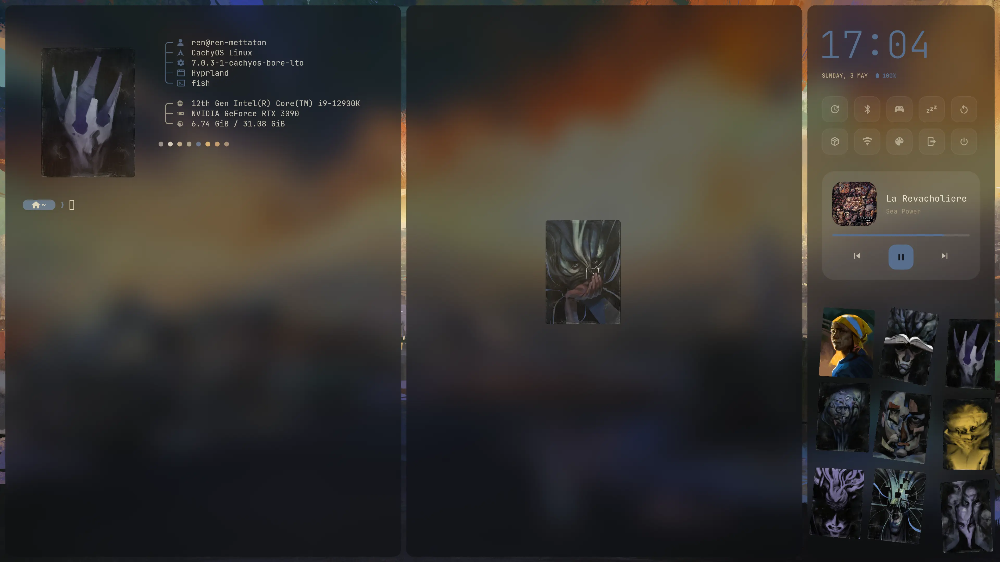
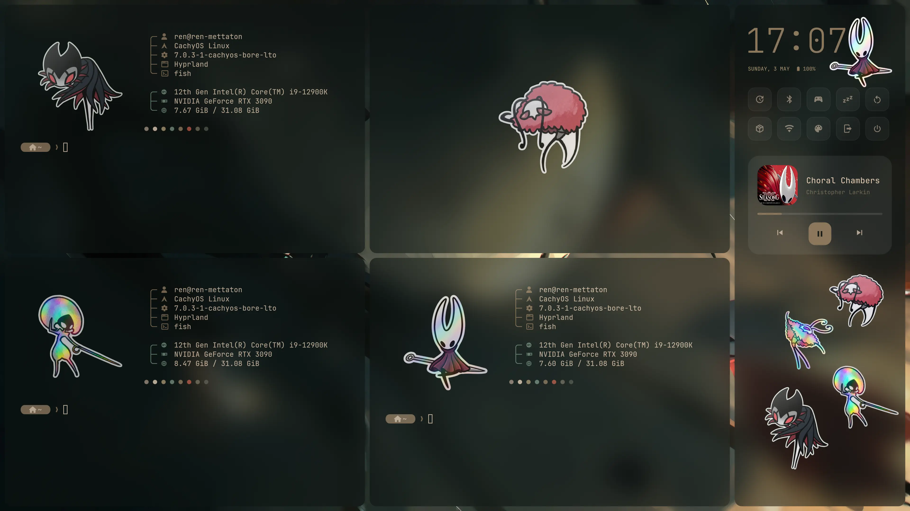
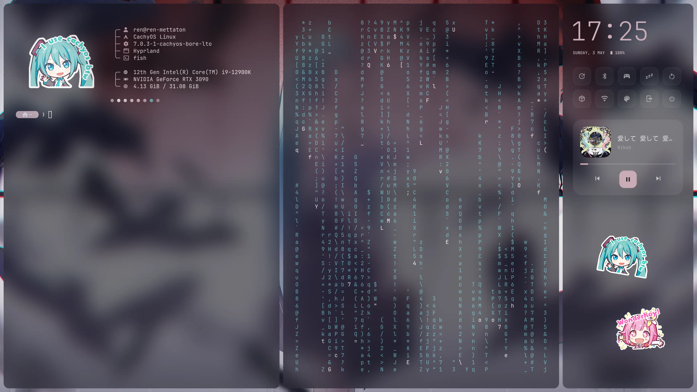
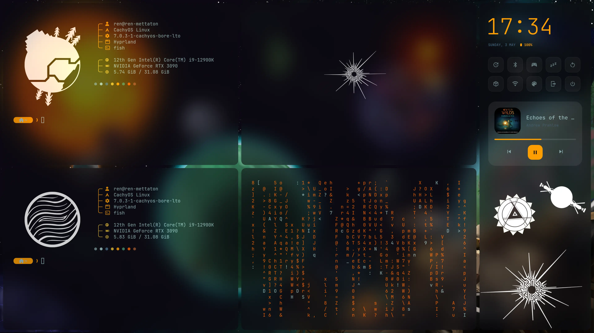
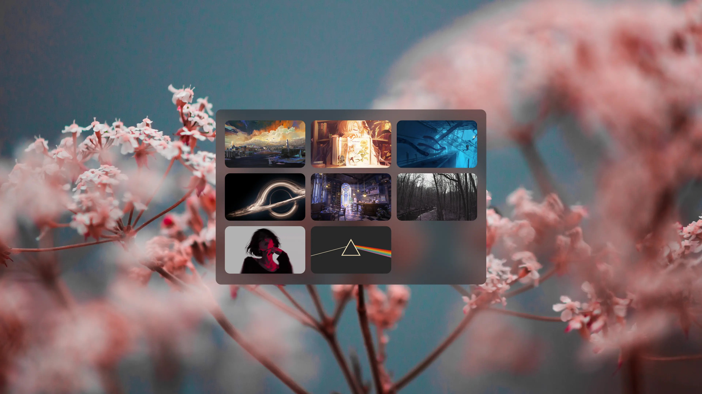

✧ quantum ✧

<b>Hyprland dotfiles by Ren</b>

  

  

<table align="center">

<tr>

<td align="center"> <b>Disco Elysium</b></td>

<td align="center"> <b>Hollow Knight</b></td>

</tr>

<tr>

<td align="center"> <b>Miku</b></td>

<td align="center"> <b>Outer Wilds</b></td>

</tr>

<tr>

<td colspan="2" align="center"> <b>Wallpicker</b></td>

</tr>

</table>

## ✦ Keybinds

<table>

<tr>

<td align="right"><kbd>SUPER</kbd> + <kbd>W</kbd></td>

<td><b>Wallpicker</b> <i>(Select Wallpaper & Apply Theme)</i></td>

</tr>

<tr>

<td align="right"><kbd>SUPER</kbd> + <kbd>Z</kbd></td>

<td>Toggle<b>Topbar</b> <i>(Quickshell)</i></td>

</tr>
<tr>

<td align="right"><kbd>SUPER</kbd> + <kbd>X</kbd></td>

<td>Toggle <b>Sidebar</b> <i>(Quickshell)</i></td>

</tr>

<tr>

<td align="right"><kbd>SUPER</kbd> + <kbd>Enter</kbd></td>

<td>Open Terminal <i>(Kitty)</i></td>

</tr>

<tr>

<td align="right"><kbd>SUPER</kbd> + <kbd>TAB</kbd></td>

<td>Open App Launcher </td>

</tr>

<tr>

<td align="right"><kbd>SUPER</kbd> + <kbd>E</kbd></td>

<td>File Manager <i></i></td>

</tr>

<tr>

<td align="right"><kbd>SUPER</kbd> + <kbd>S</kbd></td>

<td>Interactive Screenshot</td>

</tr>

<tr>

<td align="right"><kbd>SUPER</kbd> + <kbd>Q</kbd></td>

<td>Close active window</td>

</tr>

</table>

## ✦ Holograph

Holograph is a TUI that organizes your Fastfetch stickers into theme folders, letting you swap them on the fly.

### Add a New Theme

1. Go to `~/dotfiles/logo/holograph/`
2. Create a new directory here (e.g. `.../holograph/MyTheme/`).
3. Drop your `.png`, `.jpg`, or `.webp` images inside.

### Apply Theme

1. Type `holograph` in your terminal.
2. Use the **arrow keys** to browse through your folders and images.
3. Press <kbd>Enter</kbd> to **Apply** the theme. Fastfetch updates automatically!
